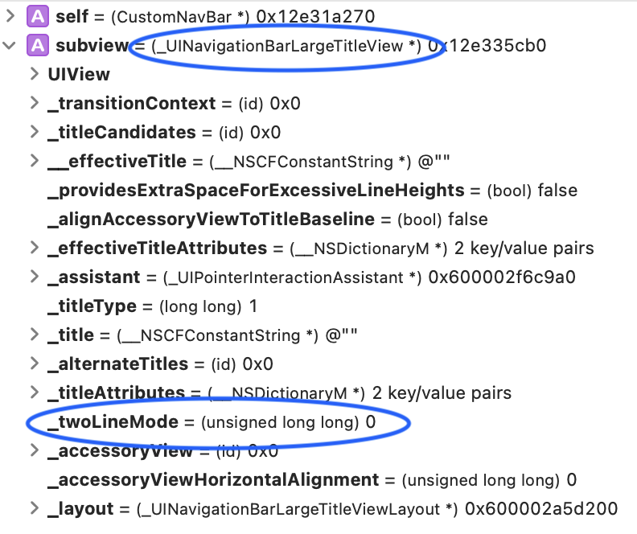
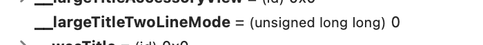
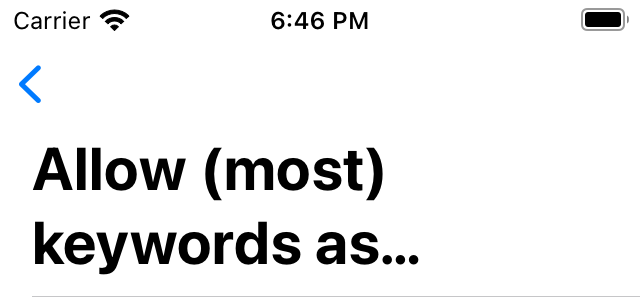

+++
title = "The hidden UINavigationBar property - large title two line mode"
date = 2020-12-28
description = "-"

[taxonomies]
categories = ["programming"]
tags = ["iOS", "hacks"]
+++

## ToC

1. [Background](#background)
1. [Community solutions](#community-solutions)
1. [Reverse engineering](#reverse-engineering)
1. [Demo project](#demo-project)
1. [The Solution](#the-solution)
1. [Notes](#notes)

## Background

Back in iOS 11, Apple introduced the **Large Title** feature, which became the usual UI for navigation bars. UIKit framework provides a [simple way](https://developer.apple.com/documentation/uikit/uinavigationbar/2908999-preferslargetitles) to enable the new shiny feature. **But**, there is a missing piece in the API: **We can't make a Large title to have two lines of text** (_or do we?_)

## Community solutions

If Apple didn't add a way to make two lines large titles, developers made their way to solve the problem. On [this stackoverflow](https://stackoverflow.com/questions/47901318/how-to-set-multi-line-large-title-in-navigation-bar-new-feature-of-ios-11) page, there are multiple solutions, which don't work in iOS 15.

[khurshedgulov](https://developer.apple.com/forums/profile/khurshedgulov) asked in [apple developer forums](https://developer.apple.com/forums/thread/671982) how to make large titles like **Apple is doing in App Store app**. Unfortunately, no one from Apple responded.

There are at least two apps from Apple that are using two lines for Large Titles: _App Store_, _Watch_.

## Reverse engineering

I was confident that there should be a hidden way to enable this feature. **Let's dig ⛏ inside UIKit**

Based on the [stackoverflow](https://stackoverflow.com/questions/47901318/how-to-set-multi-line-large-title-in-navigation-bar-new-feature-of-ios-11) answers, the starting point was to look into the view structure of `NavigationBar` itself.

I created a subclass to `NavigationBar` and put a breakpoint in the function: `didAddSubview`. I inspected every subview coming as an input parameter to this function. From all subviews, one is named `_UINavigationBarLargeTitleView` (a private Apple class), and it has a private var named `_twoLineMode` with a value of `0` (turned off)!

Two Line Mode - it is there and I just needed a way to turn it on.



I tried this

```swift
subview.setValue(1, forKey: "_twoLineMode")
```

I tried to set the value in the `didAddSubview` and `willAddSubview` functions. None worked 😩, the value was reset somewhere after view was added as subview. After long inspecting and playing around with different variables of the `_UINavigationBarLargeTitleView` object, I couldn't make it work.

I needed to find which object is controlling the `_twoLineMode` var.

`UINavigationBar` is constructed using `UINavigationItem`s. To inspect the item, I created a subclass to `UINavigationController` and overrode function `navigationBar(_:shouldPush:)` which is a function for `UINavigationBar`'s delegate. After inspecting this object, I **Found another clue!** Another private var named `__largeTitleTwoLineMode`, again, with a value of `0`.


I set this var to `1` or `true` and **HERE IT IS!**. I had a Large Title with two lines 🙌!

```swift
item.setValue(1, forKey: "__largeTitleTwoLineMode")
// OR
item.setValue(true, forKey: "__largeTitleTwoLineMode")
```



## Demo project

I created a demo project named [NavBarLargeTitle](https://github.com/BProg/NavBarLargeTitle). The project will list Swift Language Evolution proposals inside the first `UIViewController` and details in the second. It target iOS 15 and uses some iOS 14 features for configuring the `UITableView` like [cell configuration](https://developer.apple.com/documentation/uikit/uitableviewcell/3601058-defaultcontentconfiguration)

## The Solution

1. Create a custom `UINavigationController`
1. Add the protocol `UINavigationBarDelegate` to the class definition
1. Override the function `navigationBar(_:shouldPush:)`
1. Activate two lines mode using hidden variable `item.setValue(true, forKey: "__largeTitleTwoLineMode")`
1. Make `navigationController.navigationBar.prefersLargeTitles = true`

## Notes

I haven't tested every possible way to set the hidden `__largeTitleTwoLineMode` variable, and possibly, variable could be set in any place before the item is added to the `UINavigationBar`

### Green 🍀

Compatibility - the current solution works at least with iOS 15, 14, 13

### Red 🐞

Animation - the interactive back animation is not perfect in the demo project, I haven't gone further to dig into this problem.

Unreliable - we can't rely on Apple's hidden API because it can break with any new release. But the good thing, is that current solution is so simple that it can easily be updated in such a scenario.
